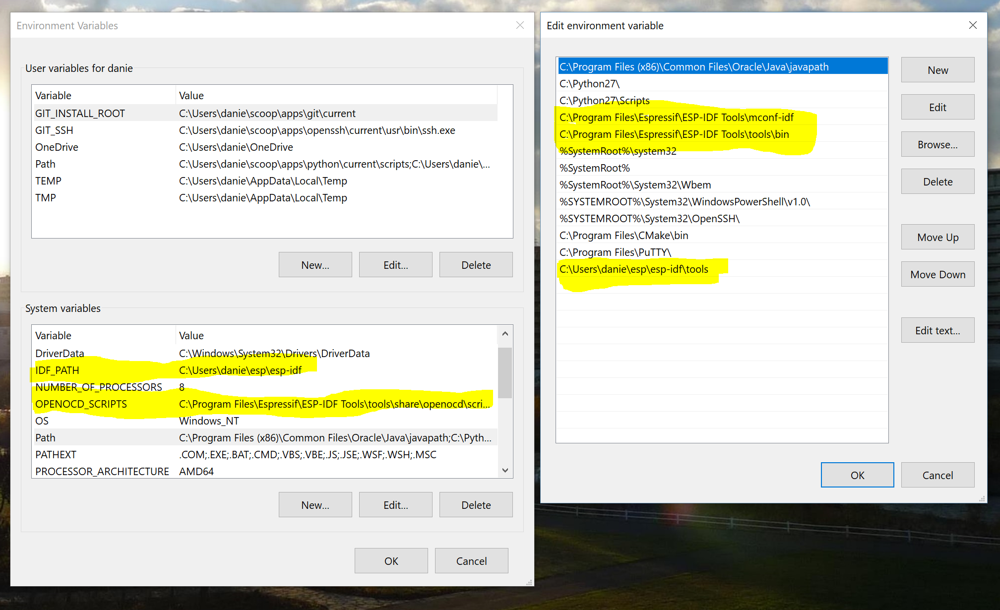
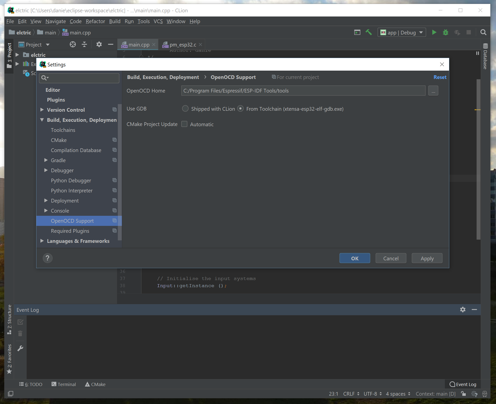
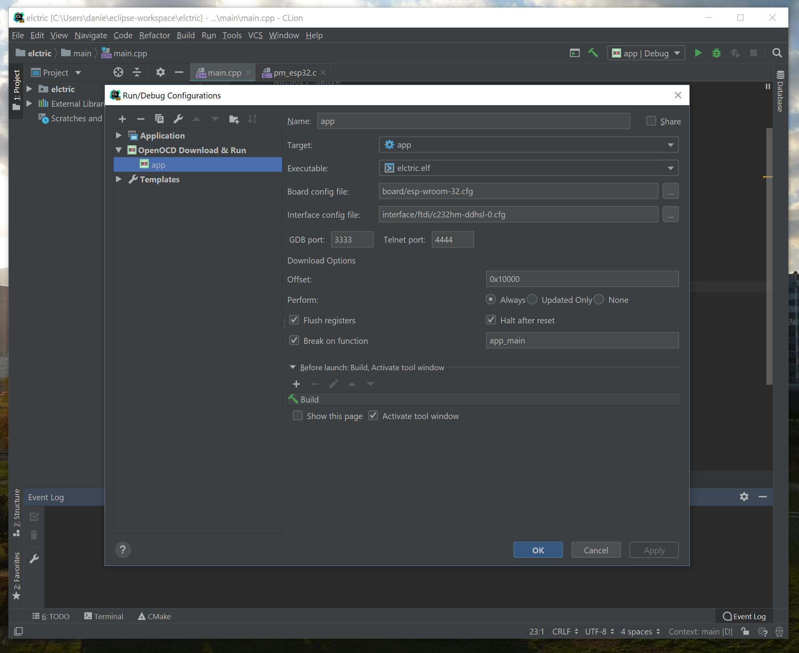

Purpose
===

The plugin supports two different, almost unrelated features:
 * Downloading and debugging binaries onto MCU chips using [OpenOCD](https://openocd.org/)

Disclaimer
===
You are doing everything at your own risk. Nor me, nor JetBrains, nor anybody else takes any 
responsibility in case of any direct or indirect damages or losses. 

Prerequisites
===
You will need following tools being installed and configured:

 * Compatible hardware. This guide was written for, and tested against the ESP-WROOM32 (DevKit C) and FTDI C232HM-DDHSL JTag USB Adaptor
 * [CLion](https://www.jetbrains.com/clion/). This project has been tested against CLion 2018.3.
 * ESP32 toolchain installed on your platform as per [the getting started guide](https://docs.espressif.com/projects/esp-idf/en/latest/get-started-cmake/index.html)

Install Plugin 
===
In CLion, go to **File  ->  Settings ... ->  Plugins  ->  Browse repositories ...** and install the plugin **"OpenOCD + ESP32 Support for embedded development"**.

Running Examples
===
Detailed guide coming soon!

Basic steps:
 1. Install the ESP32 toolchain for your platform as well as the latest (git master) ESP-IDF (Required for Cmake scripts). Ensure that all of the paths have been set (IDF_PATH etc.)
    
 2. Load an example project (recommended as a base) into Clion. Ensure that the initial Cmake build succeeds. If it fails, there is probably a path issue.
 3. Configure the path to OpenOCD as below (this is for the Windows version of the ESP toolchain)
    
 4. Create a new Run / Debug configuration as below.
    
 5. Try running / debugging your project!

Bugs, Feature requests, Questions, and Contribution
===

Please read [CONTRIBUTING.md](CONTRIBUTING.md)

Likes and Donations
===

If you like the plugin, you may :star: the project at github (button at top-right of the page) and at [jetbrains plugins repository](https://plugins.jetbrains.com/plugin/11284).
